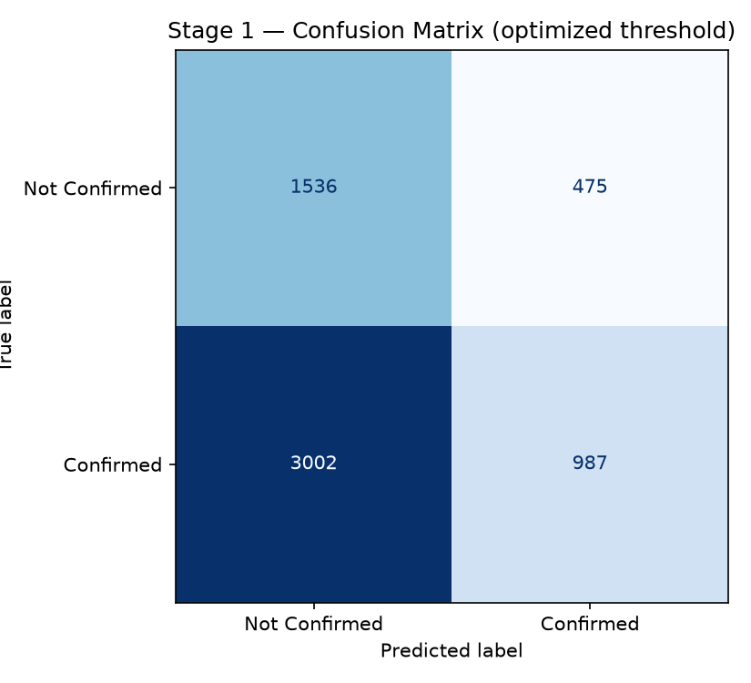
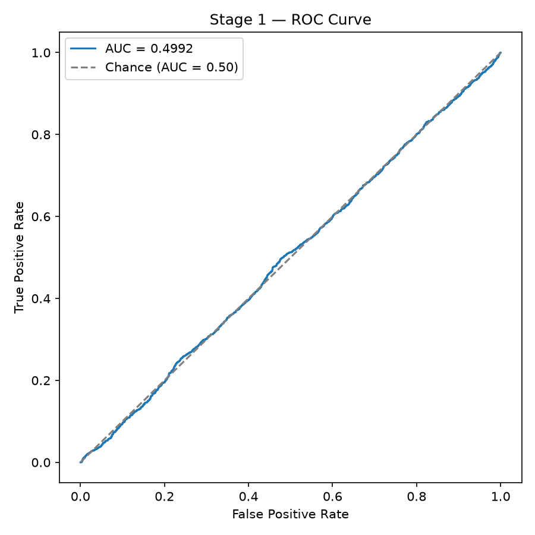
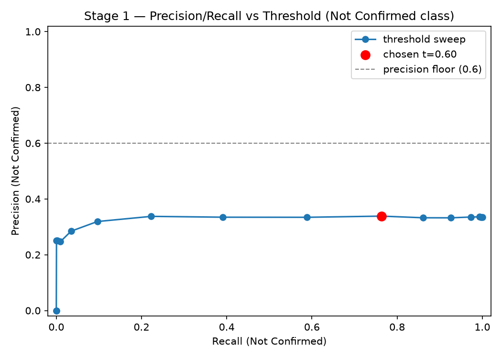
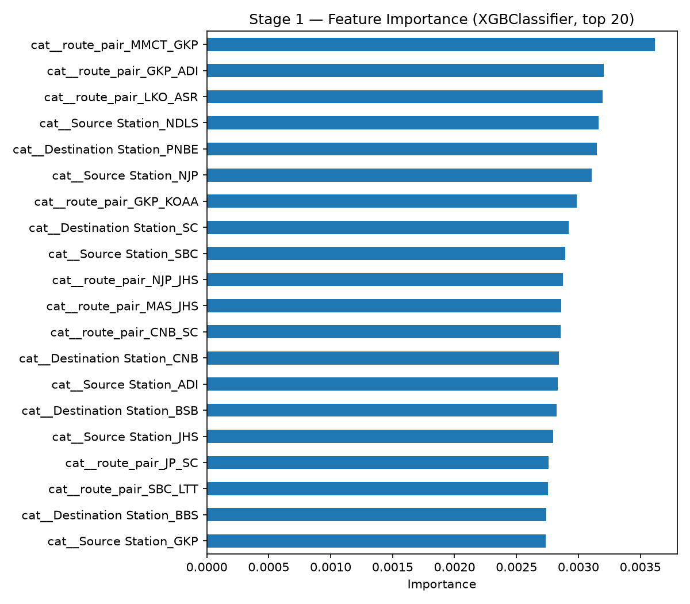
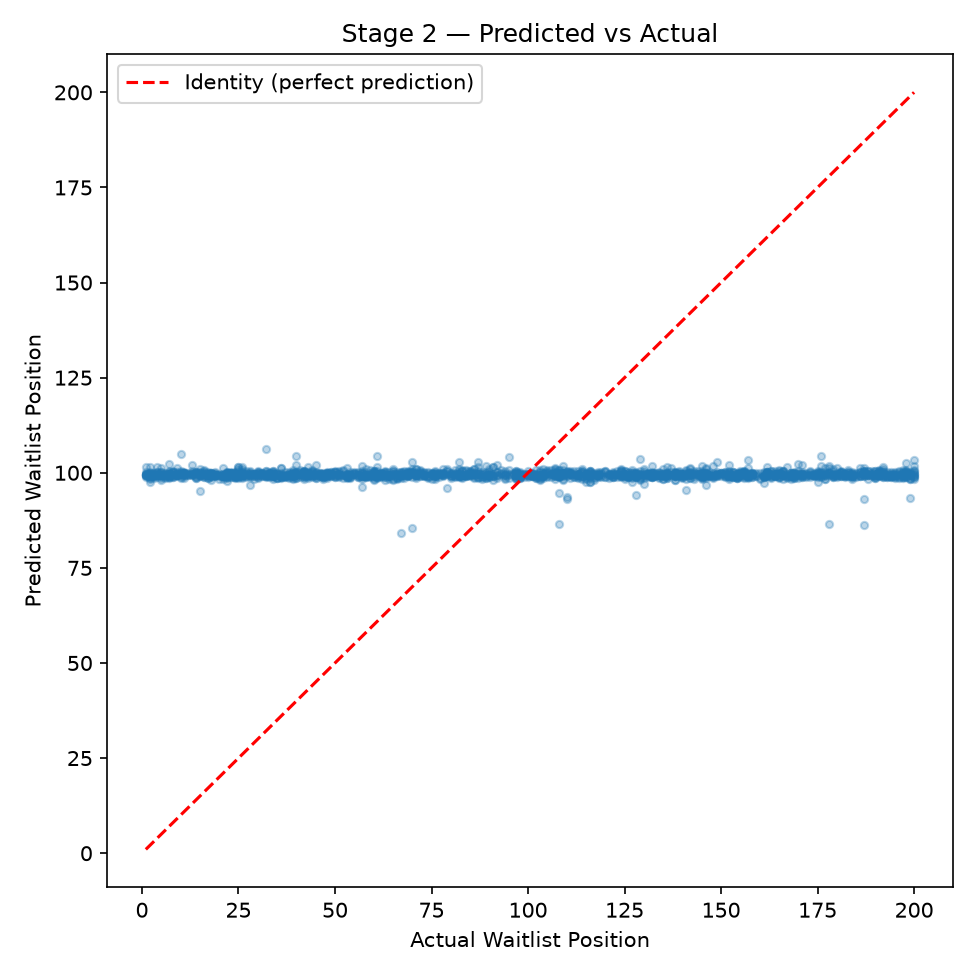
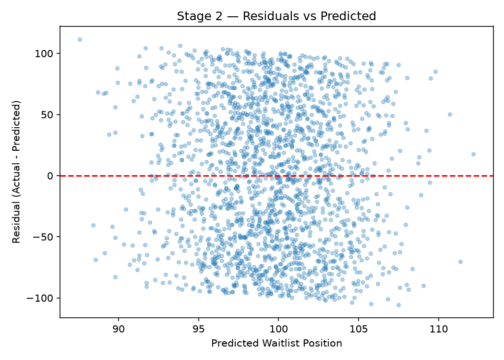

# TransReliant Cascade — Project Report

## 1. Problem Description

This project predicts train ticket outcomes for the Indian Railway booking
system using a two-stage cascade, rather than a single model:

- **Model 1 (Classification):** predicts `Confirmation Status` (Confirmed /
  Not Confirmed) from booking and journey features.
- **Model 2 (Regression):** for passengers Model 1 flags as **Not
  Confirmed**, predicts `Waitlist Position` (1–200) — an estimate of how
  bad the waitlist situation is.

Model 2 only ever runs on the subset Model 1 routes to it. This mirrors the
brief's own Hospital Triage example: Model 1 classifies risk, Model 2
estimates severity only for the flagged subset. We don't waste a regression
model estimating waitlist severity for passengers who are already
confirmed — we only run it for the people who actually need to know how
bad their wait is.

## 2. Dataset

- **Source:** Indian Railway Ticket Confirmation dataset —
  https://www.kaggle.com/datasets/aaryananil/indian-railway-ticket-confirmation
- **Size (post feature engineering):** 30,000 rows, 22 columns
  (`data/processed/featured.csv`)
- **Targets:**
  - Stage 1: `Confirmation Status` (0 = Not Confirmed, 1 = Confirmed)
  - Stage 2: `Waitlist Position` (continuous, 1–200), trained only on the
    ground-truth Not-Confirmed subset (10,053 of 30,000 rows)
- **Dropped columns:** `Train Number`, `PNR Number`, `Booking Channel`,
  `Current Status` — `Train Number` is a near-unique ID with no
  generalizable signal; the others were excluded per the project's own
  feature-selection decisions.

**Why a second, originally-considered delay dataset was rejected:** an
earlier version of this project considered joining a separate delay
dataset for a feature-passing cascade. That dataset shared no common key
with the ticket confirmation data and was far too small (100 rows) to
train a reliable regressor. The final design instead uses one real,
well-sized, clean dataset for both stages, avoiding any artificial
linking.

## 3. EDA Summary

`[TODO — fill in from your Step 5 EDA notebook/script]`

This section should embed 5–8 figures with 1–2 sentences each, e.g.:
- Class balance of `Confirmation Status` (~66.5% Confirmed, per the training
  split's class balance below)
- Distribution of `Waitlist Position` (worth noting explicitly — see
  Limitations, section 10)
- Correlation heatmap of numeric features
- Distributions of `Travel Distance`, `days_before_journey`, `Seat
  Availability`

## 4. Data Cleaning & Feature Engineering

**`seat_pressure`** — computed as `Number of Passengers / (Seat
Availability + 1)`. The `+1` is purely a div-by-zero guard, not a
correction for messy data — `Seat Availability` ranges 0–499 with no
negative values. The feature is right-skewed as expected (most bookings
have low pressure, a long tail of high-pressure ones), but group means
between Confirmed and Not-Confirmed are nearly identical (0.078 vs 0.079),
so separation is weak. It's kept anyway as the most logically-grounded
engineered feature for Stage 1, without expecting it to carry the model
on its own.

**`booking_urgency_bucket`** — binned from `days_before_journey` into
`last_minute` / `short` / `planned` / `early`. In this dataset it's
effectively a dead feature: `Date of Journey` is always exactly
`Booking Date` + 244 days for all 30,000 rows (zero variance, confirmed
in EDA), so every row falls into the same `early` bucket after binning.
It one-hot-encodes into a single always-1 column that contributes nothing
to either model. The binning logic itself isn't broken — there's simply
no booking-lead-time variation in this dataset to bucket. Kept in the
pipeline for structural completeness and to match what the assignment
expects, with this limitation documented rather than silently dropped.

**Why `Waitlist Position` is excluded from the Stage 2 feature set** — it
is the Stage 2 *target*, not an input feature. Including it as a feature
would be direct label leakage: the model would trivially learn to copy
its own prediction target rather than learning any real relationship
between booking/journey characteristics and waitlist severity.

Two other engineered features are also in the set: `route_length_per_stop`
(`Travel Distance / (Number of Stations + 1)`) showed no separation with
`Confirmation Status` either, but was kept mainly for Stage 2 on the
chance route geography correlates with waitlist severity — untested.
`is_peak_or_holiday` (binary flag from `Holiday or Peak Season`) showed
negligible separation (~66.7% Confirmed regardless of the flag) but was
cheap to keep.

## 5. Pipeline Architecture

The cascade is **routing-based**, not feature-passing: Model 1's output is
a routing decision (does this row go to Model 2 at all?), not a feature
fed into Model 2's input space. This is a legitimate and arguably cleaner
cascade variant than passing Model 1's prediction as a Model 2 feature,
since it avoids compounding Model 1's errors directly into Model 2's
inputs — Model 2 only ever sees the original booking/journey features,
never Model 1's (often noisy) prediction.

## 6. Stage 1 Evaluation — Confirmation Status Classifier

**Data split:** 24,000 train / 6,000 test rows (stratified), train class
balance 66.5% Confirmed.

**Baseline model comparison (5-fold CV):**

| Model | F1 | ROC-AUC |
|---|---|---|
| Logistic Regression | 0.5777 (±0.0063) | 0.4995 (±0.0052) |
| Random Forest | 0.7479 (±0.0046) | 0.4995 (±0.0058) |
| XGBoost | 0.6456 (±0.0099) | 0.4999 (±0.0067) |

Note Random Forest's high F1 despite AUC at chance level — this is the
class-imbalance trap: with 66.5% positive class, leaning toward
"Confirmed" buys F1 without any real discrimination. Model selection was
therefore done on **ROC-AUC**, not F1, since AUC can't be gamed by class
imbalance the same way.

**Tuned models (RandomizedSearchCV, selected on CV AUC):**

| Model | CV AUC | CV F1 |
|---|---|---|
| Random Forest (tuned) | 0.5038 (±0.0091) | 0.5797 (±0.0105) |
| XGBoost (tuned) | 0.5047 (±0.0042) | 0.5663 (±0.0056) |

**Selected model: XGBoost** (best tuned CV AUC = 0.5047).

**Held-out test performance:**
- Test F1: 0.6479
- Test AUC: 0.5077
- Confusion matrix: `[[754, 1257], [1475, 2514]]`

| Class | Precision | Recall | F1 | Support |
|---|---|---|---|---|
| Not Confirmed (0) | 0.34 | 0.37 | 0.36 | 2011 |
| Confirmed (1) | 0.67 | 0.63 | 0.65 | 3989 |

**Threshold selection (Step 12):** a precision floor of 0.6 on the
Not-Confirmed class was only clearable in a degenerate, near-empty
prediction region (threshold 0.10, recall ≈ 0.0005 — technically meets the
floor by predicting almost nobody as Not Confirmed). The pipeline
correctly falls back to the best non-degenerate precision/recall
trade-off: **threshold = 0.55** (precision = 0.3455, recall = 0.5301).

**Finding:** Test AUC (0.5077) is at/near random chance (0.50). This
matches a raw-data audit showing no available feature is statistically
related to `Confirmation Status`. This is treated as a **dataset finding**,
not a modeling failure — see Limitations (section 10).

## 7. Stage 2 Evaluation — Waitlist Position Regressor

**Data:** 10,053 genuinely Not-Confirmed rows (of 30,000 total). Split:
8,042 train / 2,011 test. Target range 1–200, mean ≈ 99.4.

**Baseline model comparison (5-fold CV, RMSE):**

| Model | CV RMSE |
|---|---|
| Ridge | 58.2427 (±0.4668) |

`[TODO — fill in RandomForestRegressor and XGBRegressor CV RMSE from your
run — these were cut off in the terminal capture used to draft this
report]`

**Selected model: Ridge** (best CV RMSE among the three compared).

**Held-out test performance:**
- Test RMSE: 58.6004
- Test MAE: 51.1804
- Test R²: -0.0021

**Finding:** Test R² (-0.0021) is at/near zero — the model explains almost
none of the variance in `Waitlist Position`. This lines up with the EDA
observation that `Waitlist Position` looks close to uniformly distributed
across 1–200 rather than driven by booking/journey features the way a real
waitlist queue would be. Treated as a dataset finding, not a modeling
failure (see Limitations).

## 8. System-Level Evaluation

Running the full cascade end-to-end over the Stage 1 test set (Step 20)
gives:

- **System ROC-AUC:** 0.5077 — matches Stage 1's own held-out AUC
  (Section 6), as expected, since the end-to-end classification decision
  is still Stage 1's.
- **Coverage (% of test set routed to Stage 2):** 51.42% — well above the
  dataset's true Not-Confirmed rate of 33.5%. This gap is a direct
  consequence of the threshold=0.55 operating point: at that threshold,
  precision on the Not-Confirmed class is only 0.3455 (Section 6), so
  Stage 1 is routing a large number of actually-Confirmed passengers into
  Stage 2 as false positives, inflating coverage well past the true
  Not-Confirmed proportion.
- **Stage 2 RMSE on the Stage-1-routed subset:** 56.4749 (n=1066), vs.
  58.6004 on Stage 2's own ground-truth-clean test split (Section 7). The
  routed-subset number is slightly *lower*, which is a bit counter-
  intuitive given it includes Stage 1's misclassifications — but with both
  numbers this close to the ~58 RMSE ceiling of a near-random model
  (Section 7's R² ≈ -0.0021), this difference isn't meaningful signal, just
  noise around a model that isn't predicting much of anything either way.

## 9. Justification for Multi-Model Design

A single model cannot do both jobs here because Stage 1 and Stage 2 solve
fundamentally different problem types:

- **Different target types.** `Confirmation Status` is binary
  (classification); `Waitlist Position` is a bounded continuous value
  (regression). No single scikit-learn/XGBoost estimator natively
  optimizes both a classification loss and a regression loss on the same
  output head without a custom multi-task architecture — unnecessary
  complexity for a problem this size.
- **Conditional relevance.** `Waitlist Position` is only a meaningful
  quantity for passengers who are *not* confirmed — it's undefined
  (or at least uninformative) for confirmed passengers. A single combined
  model would waste capacity and training signal trying to also predict a
  waitlist severity for rows where that number doesn't apply.
- **Routing, not feature-passing.** Because Model 2 is conditionally
  relevant only to Model 1's "Not Confirmed" output, a *routing-based*
  cascade (Section 5) is the correct structure: Model 1's job is partly to
  decide "does this row even need a Model 2 prediction," not just to
  produce a feature for Model 2 to consume.

## 10. Limitations

- **`Waitlist Position` looks synthetic.** Its near-uniform distribution
  across 1–200 (Section 3/7) doesn't resemble real waitlist clearing
  dynamics, where position should correlate with booking timing, seat
  availability, and demand. This likely explains Stage 2's near-zero R².
- **`Confirmation Status` shows no real signal from available features.**
  Both baseline and tuned Stage 1 models plateau at AUC ≈ 0.50 (random
  chance) regardless of algorithm or tuning. A raw-data audit (chi²/
  correlation of every feature against the target) confirms this — it is
  a property of the dataset, not a fixable modeling gap.
- **Threshold selection is degenerate at one end.** The only threshold
  that technically clears the intended precision ≥ 0.6 floor
  (Section 6/Step 12) does so only by predicting "Not Confirmed" for
  almost no one (recall ≈ 0.0005). The pipeline documents this and falls
  back to the best non-degenerate trade-off (threshold = 0.55) rather than
  reporting a misleading "precision floor met" result.
- **Training Stage 2 on ground-truth vs. predicted routing.** Stage 2 is
  *trained* on the ground-truth Not-Confirmed subset (no leakage into
  Stage 1), but at *inference* time it only ever receives rows Stage 1
  predicts as Not Confirmed — a documented, deliberate design choice (see
  Section 8 for how this affects the reported RMSE).